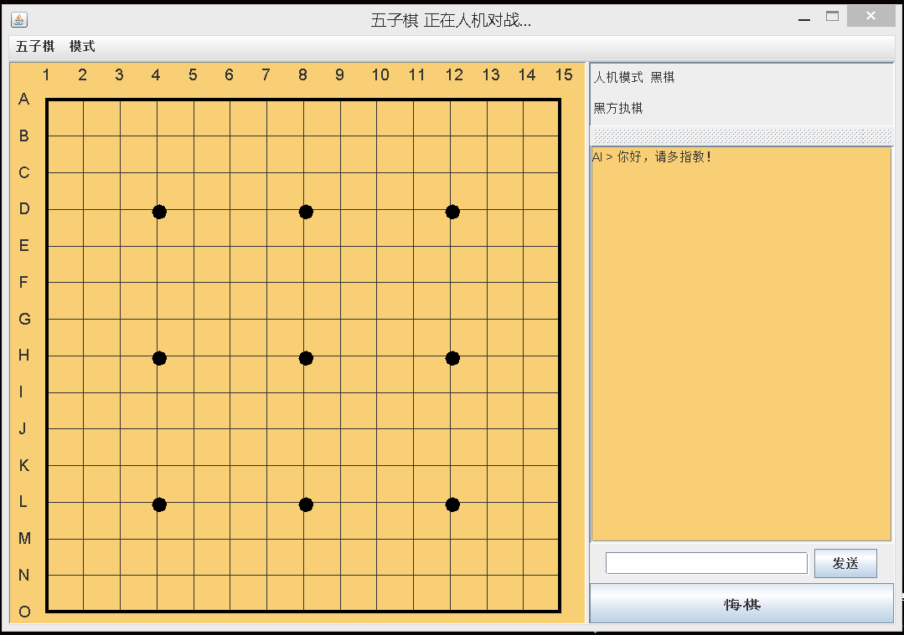
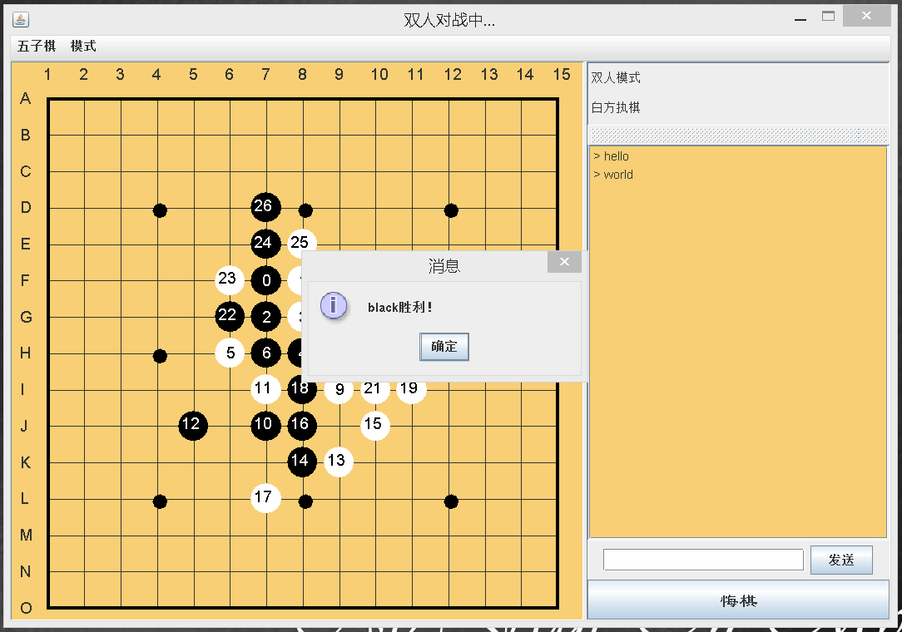
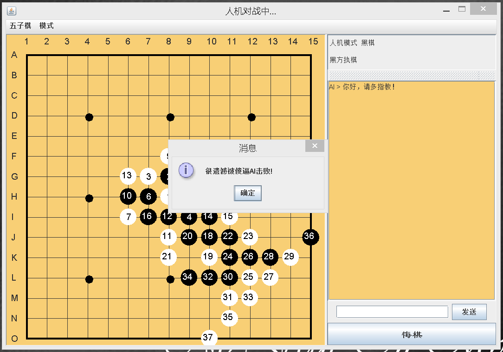
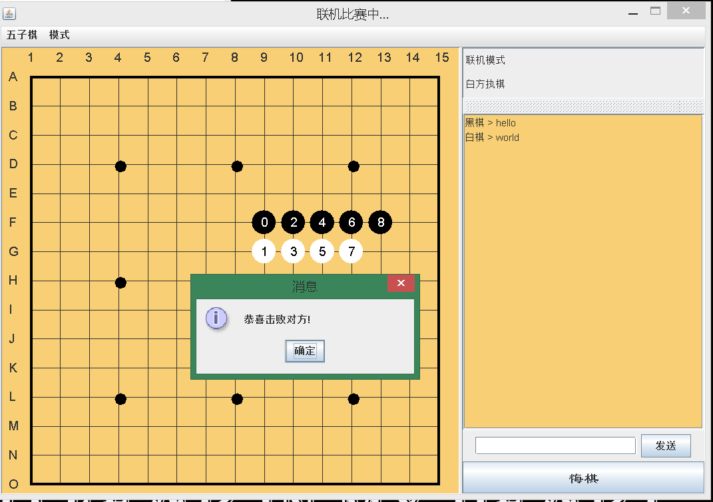
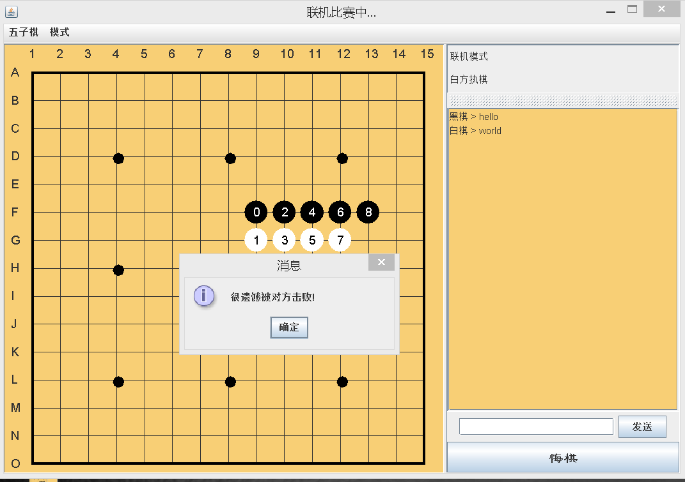
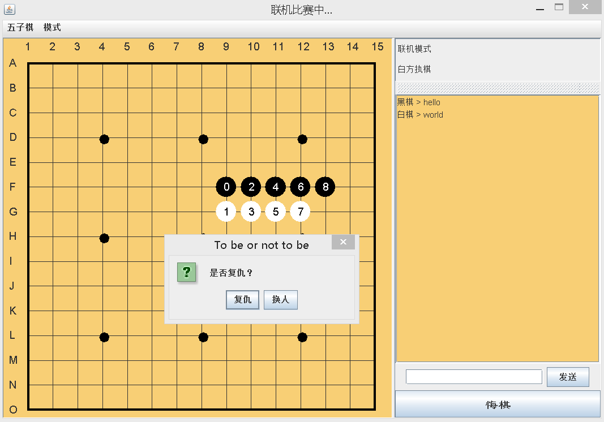
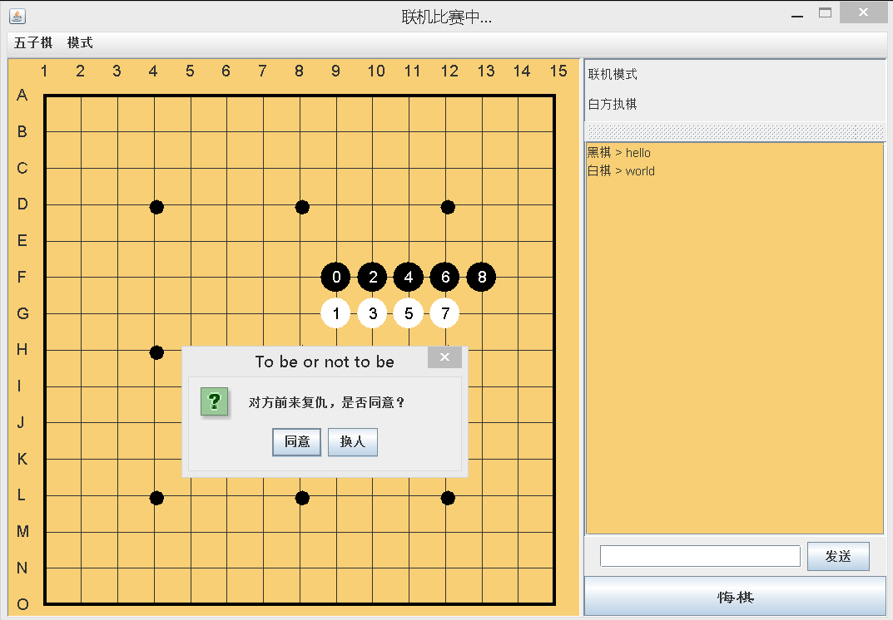
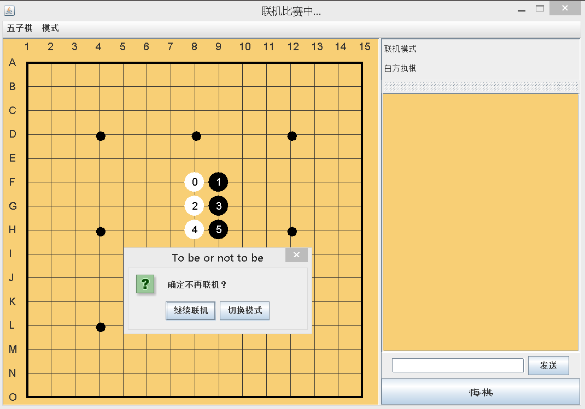
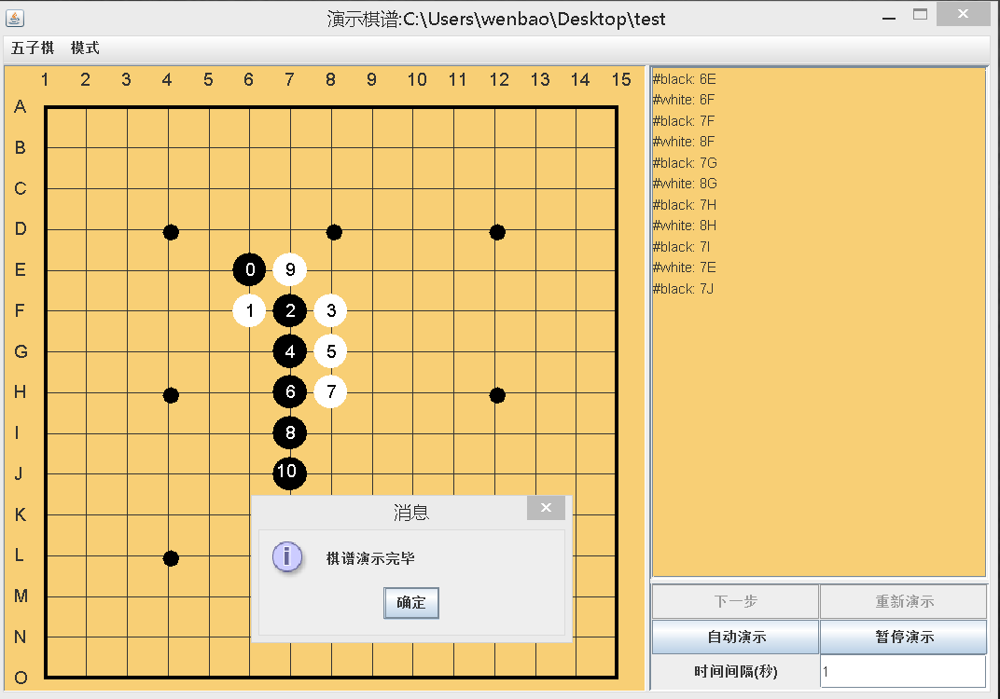
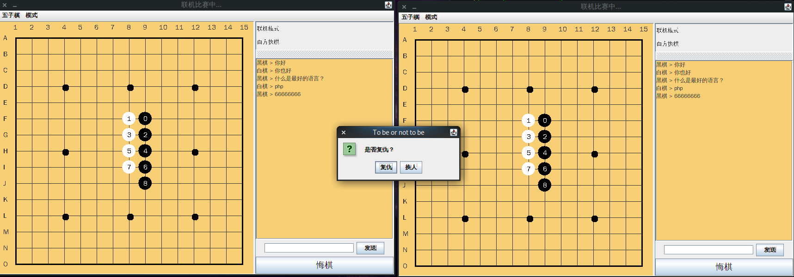

# 五子棋

## 游戏介绍

​利用java开发的具有人机、双人、联机、聊天等功能的五子棋

## 功能介绍

### 基本框架

实现五子棋的界面设计和游戏逻辑，包括菜单栏、棋盘、棋子、状态栏、聊天框、胜负判断、悔棋、保存棋谱、演示棋谱等

#### 胜负判断

比较简单，每次落子后检测是否连成五子，具体方法为：
以落子点为中心分别向上、下、左、右、左上、右下、左下、右上八个方向计算颜色相同的棋子个数，若其中任意一条直线满足条件，则游戏结束

#### 保存、演示棋谱

创建一个```LinkedList<point>```记录每次落子点，结束后写入文件，演示时读取文件模拟落子即可。

### 双人

按照黑白棋轮流落子，逻辑简单，不表

### 人机

利用博弈搜索树等相关算法设计AI，聊天...随机访问聊天库 :-)

AI核心为：将当前局面看作根进行递归搜索，建立搜索树，每次为搜索点打分，利用极大极小算法剪枝优化搜索范围、置换表优化搜索效率、多线程优化搜索时间，找出最佳落子点，甚至必胜态。

由此可知，递归层数越多，越接近真理。相对时间越久

五子棋已被证明先手存在必胜态，所以出现有禁手玩法。

个人感悟：五子棋规则简单，所有的落子方法完全可以枚举出来，高效AI完全可以战胜人类。况且连复杂的围棋都被AI拿下。在计算方面AI确实高于人类，可想而知，未来关乎运算的事情AI都可以胜任。但是只是运算而已，想要达到“人”的级别还相差甚远。

### 联机

设计传递数据包的格式，包括什么是聊天、什么是落子，什么是复仇，什么是离开（具体查看代码）

客户端:创建线程与服务器协商交互

服务器:主要负责客户端的连接、数据包的转发、客户端的离开，这里使用```ExecutorService```来统一管理线程

注意：涉及到线程不得不说的就是同步```synchronized```问题，这里体现在匹配对手的过程中，必须处理好同步，即操作的原子性（具体查看代码）

## 部分界面展示













## 持续完善中。。。